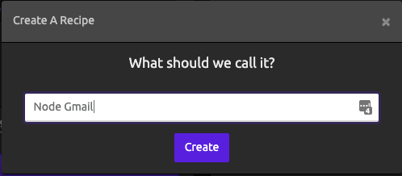
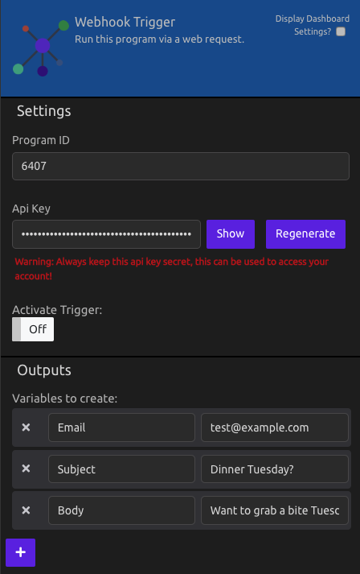
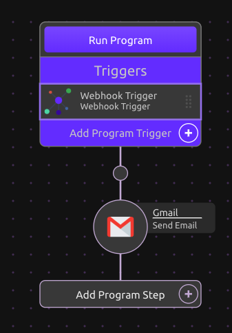
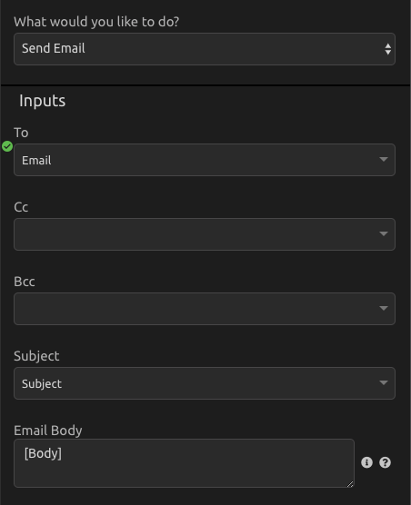
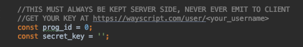
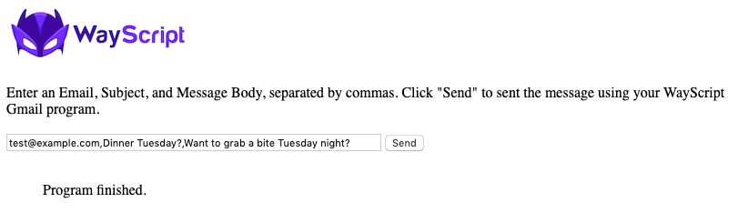

# WayScript Node to Gmail Example

In this example, a user can submit an email, subject, and message body via a node server, and the data is passed to WayScript, which sends the message using Gmail.

## Setup Node Application

If you don't already have it installed, install node: https://nodejs.org/en/

In the app root directory, type
```
npm install 
```

To Run The Server:
```
node app.js
```

If running properly, you should see: "WayScript Node Example Running" in your terminal

In your browser go to http://127.0.0.1:8081

## Setup WayScript Program

1) If you don't have one already, register for a WayScript account at https://wayscript.com.

2) Create a New Program<br>
    

3) Add a Webhook Trigger<br>
    <br>
    - In the Outputs section of the Trigger Module, create a Variable Called 'Email' and give it a default value (i.e. test@example.com )
    - In the Outputs section of the Trigger Module, create a Variable Called 'Subject' and give it a default value (i.e. Dinner Tuesday? )
    - In the Outputs section of the Trigger Module, create a Variable Called 'Body' and give it a default value (i.e. Want to grab a bite Tuesday night? )
    - Take note of your Program ID and API Key<br><br>
    

4) Drag in the Gmail Module as your next step<br>
    

5) Setup your Gmail module
    - Select your Gmail account
    - Choose "Send Email" under "What would you like to do?"
    - Under Inputs:
        - Select the "Email" variable in the "To" field
        - Select the "Subject" variable in the "Subject" field
        - In the "Email Body" field, type "[Body]" to print the text of your body variable.

    

## Run App

1) Open your app.js file and input your Program ID and API Key (shown in the Webhook Trigger) into the file.

    

2) Restart your Node Server to update your changes and refresh the site page.
    ```
    node app.js
    ```
3) Press the "Send"  button and the WayScript program sends your message using Gmail!

   
